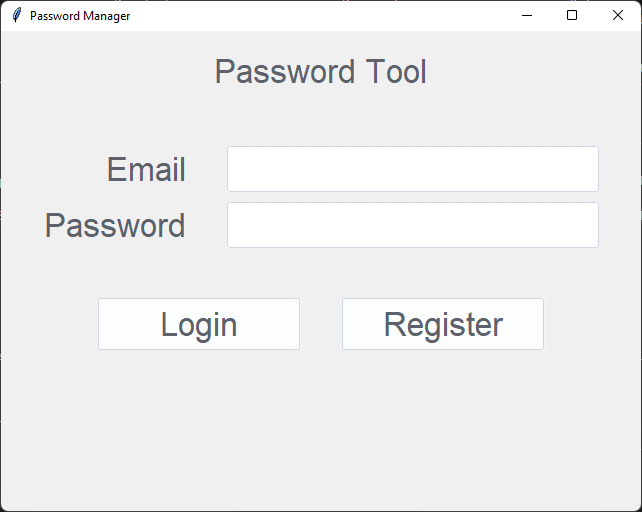

# CZ4010 Applied Cryptography Course Project - BoHack (Password Management Tool)

> Note: This password manager tool was created as a project and is NOT intended for actual use.
> Please use an established, preferably open source password manager to store important passwords as they are likely to be audited by security experts.

## Group Members

- Tan Jun Hong
- Lim Xiao Wei

## Motivation

According to Dr Tay Kian Boon, there are many incorrect applications of cryptography in the real world. For instance,
Nadia's paper found that there are keys generated in real life that have insufficient entropy due to faulty
implementations. As such, there are many minefields to be aware of.
 In order to gain a deeper understanding of cryptography, it is crucial to apply these concepts, preferably on a
project. As such, we decided to create a secure and authenticated password management tool, which will give a deeper
insights on the inner workings.

## Research

### Choosing a password hashing library

We began searching for a password hashing library that meets the following criteria:

- Well documented and transparent, so we can understand the mechanics behind and verify that it is secure
- Widely used and open source, which makes it more reliable and likely to be tested by security experts
- Frequently updated, in order to keep up with the latest best security practices
- Compatible with Python, since that is the language we are using

[**Passlib**](https://passlib.readthedocs.io/en/stable/index.html) is eventually chosen for the as it fulfills the
considerations mentioned above.

[**PyCryptodome**](https://pycryptodome.readthedocs.io/en/latest/index.html) is also used as Passlib does not support
AES.

### Choosing the hash function

After choosing the password hashing library, we need to choose the hash functions. These are the criteria we are looking
for:

- Secure and deterministic, which means it uses a CSPRF
- Widely used and tested
- No known major vulnerabilities as of the time of writing

We decided on the following hash functions:

#### [**passlib.crypto.digest.pbkdf2_hmac()**](https://passlib.readthedocs.io/en/stable/lib/passlib.crypto.digest.html)

It is a PBKDF v2.0 using HMAC. It is used to generate the vault key, which is used to decrypt the vault.
  This function is used for vault key instead of pbkdf2_sha256 is because we are able to set the vault key length to
meet the requirements of AES.

#### [**pbkdf2_sha256**](https://passlib.readthedocs.io/en/stable/lib/passlib.hash.pbkdf2_digest.html)

This class implements a generic PBKDF2-HMAC-SHA256-based password hash. It will run through the pbkdf2_hmac function
mentioned above, as well as a PRF build from HMAC and the respective message digest. It is used to generate the
authentication key, which is used to retrieve the vault from the database.

### Choosing the encryption function

These are the criteria we are looking for:

- Secure and deterministic, which means it uses a CSPRF
- Widely used and tested
- No known major vulnerabilities as of the time of writing

[**AES**](https://pycryptodome.readthedocs.io/en/latest/src/cipher/aes.html) is eventually chosen as it fulfills the
considerations mentioned above. Specifically, we are using CBC mode of operation.

### Choosing the database

These are the criteria we are looking for:

- High uptime and ran by reputable company
- Automatically handles authentication, so we do not need to handle it (Leave it to experts)
- Good documentation
- Widely used and tested

[**Google Firebase**](https://firebase.google.com/) is eventually chosen as it fulfills the considerations mentioned
above. The documentations state that scrypt algorithm is used for the password hashing. scrypt is a PBKDF specifically
designed to make it costly to perform large-scale custom hardware attacks by requiring large amounts of memory.

### Usage of parameters

After choosing the functions, we need to figure out how to effectively use them.
We researched on how other existing password managers worked, and borrowed their concepts.
One of the videos we referenced from is [**How Password Managers Work - Computerphile**](https://www.youtube.com/watch?v=w68BBPDAWr8)

#### Generating vault key

(TODO) Use of salt, plaintext, aes, uuid

#### Generating authentication key

(TODO)

## Design

There are two things in mind when it comes to our design - convenience and security Since we are storing passwords, it
is important to make our system as secure as possible, while ensuring ease of use. If the password management tool is
not easy to use, it defeats the purpose and the users may resort to weak methods to store their passwords.

### Convenience

#### Remote storage

To ensure ease of use, we decided to store the vaults on a remote server, as compared to a local storage. This way, the
user can run the program on a different machine and is still able to retrieve their passwords easily. For this function,
we used Google Firebase's Realtime Database to store our passwords.

#### Clipboard
Since passwords are often complex, we allow users to copy the stored password into a clipboard to use it on
the website. This reduces the chance of incorrect input, and is much faster, so the user does not need to keep the vault
open as long. The clipboard will automatically expire in 10s, and it will be replaced by an empty string. This allows
for more security, in case the user forgets to clear the password from the clipboard. For maximum security, we recommend
users to disable clipboard history.

### Security

Security is our utmost priority. We have to ensure that even if the database is leaked, the attackers have no way of
knowing decrypting the vaults and knowing the owner of the vaults. Here are some ways to ensure this:

- We use AES-CBC 256-bit encryption for vault data, and PBKDF2 SHA-256 to derive the vault key and authentication key.
  The database only stores encrypted data.
- The vault key never leaves the client, and as such it is impossible to sniff and intercept the vault key.
- The authentication key is sent to the server to retrieve the corresponding vault. Since the authentication key is
  generated using a strong hash function, anyone who has access to the vault data in the database has no idea who the
  vault belongs to.
- When displaying a website's login information, the password is masked out initially, to prevent people nearby from
  seeing it.
- When comparing passwords (i.e. check if old passwords are being used), we use the built-in `verify()` function
  provided by the libraries instead of `==`. This ensures a "constant time" equality check, which mitigates timing
  attacks.
- Variables that contains sensitive information are immediately deleted with `del` after usage.
- We make use of cryptographic libraries instead of writing our own, as they are maintained by cryptography experts and
  are likely to be more reliable.

## Development

### Python
- **passlib** -> For hashing/comparisons of old passwords, as well as generating vault key and authentication key, using PBKDF2 SHA-256
- **pycryptodome** -> For encryption using AES-CBC 256-bit
- **Pyrebase4** -> Pyrebase with updated dependencies, to connect to Google Firebase (Uses pycryptodome as well)
- **ttkthemes** -> Themes for Tkinter
- **Pycharm** -> Integrated Development Environment, for development of this application

### Google Firebase
- **Realtime Database** -> Cloud-hosted NoSQL database, for access to vault anywhere

## Use of the code

Please ensure you have Python 3.10 installed. (Only tested in Python 3.10, may work in other versions)

1. Clone this repository
2. From the root folder, run `pip install -r requirements.txt`
3. Navigate to the `pw_tool` folder
4. Run `main.py`. You should see the following screen 
5. Register for an account, and you are ready to go!

---

## Limitations

Strings in python are immutable, so there is a chance the password is still in memory even after calling `del`. There is
the possibility the operating system will swap the whole memory page ut to disk, where it could sit for months. However,
since this requires an attack on the client, we consider the risk of this attack minimal. If the attacker has access to
the client, there are more serious things to worry about.

## Glossary

- **CS** - Cryptographically Secure
- **PRF** - Pseudo-Random Function
- **PBKDF** - Password-Based Key Derivation
- **HMAC** - Hash-Based Message Authentication Code
- **SHA** - Secure Hash Algorithms
- **AES** - Advanced Encryption Standard
- **CBC** - Cipher-Block Chaining

## Precautions

This password management tool securely encrypts your passwords but this security is only as strong as the weakest
component. Follow these basic guidelines to ensure that your vault is safe even if your passwords are exposed:

- Choose a unique password that is not used anywhere else
- Use a highly-varied set of different characters (alphanumeric, symbols, spaces)
  * Best if it is generated through a reputable password management tool
- Use sufficiently long password
- Do not include personal information or words in the password
- Never share your password, not even with your most trusted friends!

## TODO

- Set minimum password strength
- Generation of random passwords
  * Auto copy password to fill in, with timer expiry
  * Generate password - save generated passwords and show history
- Talk about integrity of passwords
- Add checksum?
- Slides
- Video
